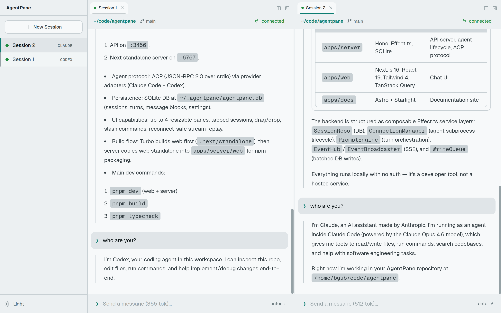

# AgentPane

Web UI for AI coding agents. Runs locally — no deployment needed.



## Quick Start

```sh
npx agentpane
```

This starts an API server on port 3456 and a web frontend on port 6767. Open [localhost:6767](http://localhost:6767) in your browser.

## Features

- **Multi-pane layout** — Up to 4 resizable panes with tabs, drag-and-drop sessions
- **Agent Client Protocol (ACP)** — JSON-RPC 2.0 over stdio for agent communication
- **Multiple agents** — Claude Code and Codex support out of the box
- **Streaming** — Real-time SSE with reconnect-safe replay
- **Persistent history** — SQLite-backed sessions, turns, and message blocks
- **Slash commands** — Agent-provided commands with autocomplete

## Requirements

- Node.js >= 22

## Development

```sh
git clone https://github.com/bgub/agentpane.git
cd agentpane
pnpm install
pnpm dev
```

`pnpm dev` starts both the Next.js dev server (port 6767) and the Hono API server (port 3456) via Turborepo. The frontend rewrites `/api` requests to the backend.

## Architecture

Turborepo + pnpm workspaces monorepo with three apps:

| App | Path | Description |
|---|---|---|
| **Server** | `apps/server` | Hono + Effect.ts API server, published to npm as `agentpane` |
| **Web** | `apps/web` | Next.js 16, React 19, Tailwind CSS 4, TanStack React Query |
| **Docs** | `apps/docs` | Astro + Starlight documentation site |

The server spawns agent subprocesses and communicates via ACP. The frontend connects to the server over same-origin HTTP + SSE. Data is stored in SQLite at `~/.agentpane/agentpane.db`.

See [CLAUDE.md](./CLAUDE.md) for detailed architecture, API routes, key patterns, and contributor guidelines.

## License

MIT
