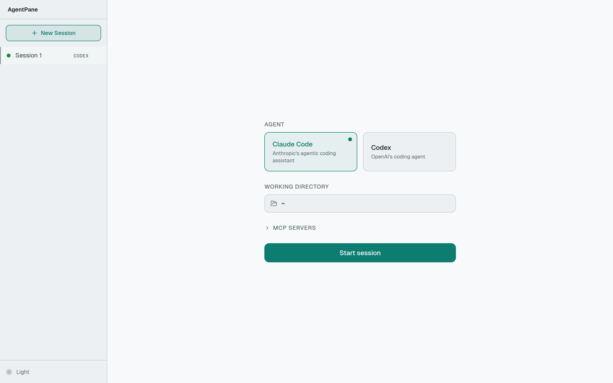

## Prerequisites

- **Node.js 22+** (LTS recommended)
- An AI coding agent installed locally (e.g. [Claude Code](https://docs.anthropic.com/en/docs/claude-code))

## Quick Start

```sh
npx agentpane
```

This starts an API server on **http://localhost:3456** and a web frontend on **http://localhost:6767**. Open [localhost:6767](http://localhost:6767) in your browser.

## Your First Session

1. **Choose an agent** — Select from the available providers (Claude Code, Codex) on the setup screen.
2. **Pick a working directory** — The agent will operate in this directory.
3. **Start chatting** — Type a prompt and the agent begins working. You'll see tool calls, file edits, and responses streamed in real time.



## Development Setup

To work on AgentPane itself:

```sh
git clone https://github.com/bgub/agentpane.git
cd agentpane
npm install
npm run dev
```

This starts:
- **Next.js dev server** on port 6767
- **Hono API server** on port 3456

The Next.js dev server rewrites `/api` requests to the backend automatically.
